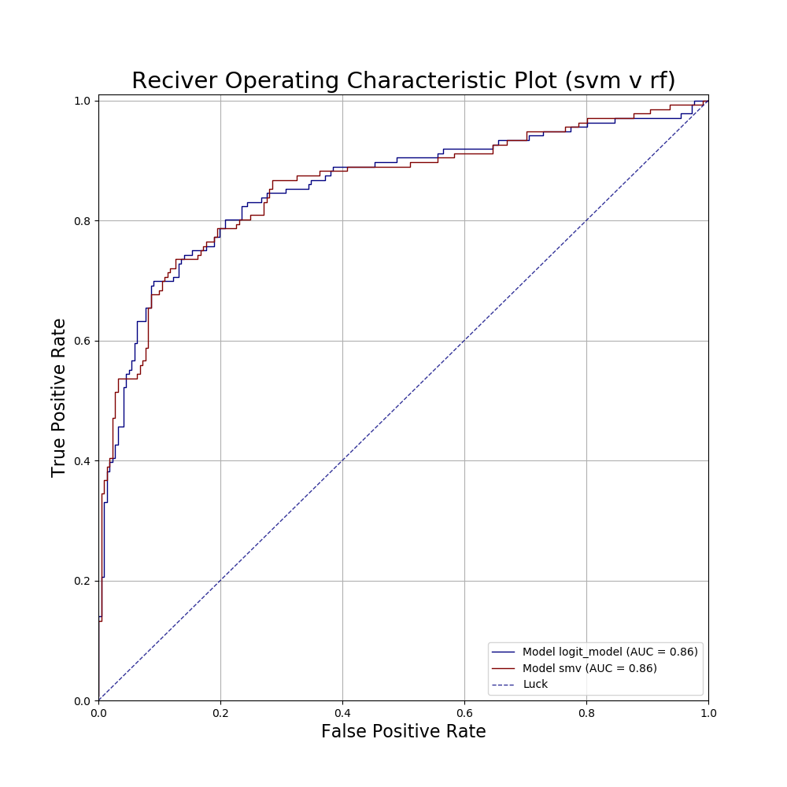

# Classifier Evaluator
#### _a classification model evaluation package_

## Abstract
This package provides an easy way to run model evaluation and comparison among multiple classification models.
The evaluation metrics include:  
- TP, FN, FP, TN;
- Recall, FNR, FPR & TNR;
- Precision, FDR, FOR & NPV;
- LR+, LR-, DOR, F1;
- Prevalence, Accuracy;
- Confusion Matrix & Confusion Matrix by thresholds (Binary Classification);
- ROC, AUC;
- Trade Off Margin;
- Visualisations of multiple curves;
- Dual-Threshold;

## Usage

#### 1. Using Standalone Metrics
Metrics can be accessed in the `metrics` module.

#### 2. Using an Evaluation Panel (Binary Classification)
'Evaluation Panel' is used to compute given metrics for comparison among models at once for a binary classification. 
```python
from classifier_evaluator.eval_panel import ClassifierEvalPanel

# init:
eval_panel = ClassifierEvalPanel()

# inject data (the easy way)
eval_panel + true_series + predicted_prob_m_1 + predicted_prob_m_1 + ...

# run metrics:
eval_panel.confusion_matrix_by_prob()
```
The resulting confusion matrix table will be computed for a given set of thresholds (where threshold is defined as, [0, 1], the threshold set on predicted probabilities such that any predicted probability greater or equal to the threshold will be classified as the positive class).

|    |   threshold |   TP |   FN |   FP |   TN |   Recall |   FNR |   FPR |   TNR |   Precision |   FOR |   FDR |   NPV |   Prevalence |   Accuracy |   LR+ |   LR- |    DOR |    F1 |
|---:|------------:|-----:|-----:|-----:|-----:|---------:|------:|------:|------:|------------:|------:|------:|------:|-------------:|-----------:|------:|------:|-------:|------:|
|  0 |         0.4 |  109 |   27 |   47 |  174 |    0.801 | 0.199 | 0.213 | 0.787 |       0.699 | 0.134 | 0.301 | 0.866 |        0.381 |      0.793 | 3.769 | 0.252 | 14.946 | 0.747 |
|  1 |         0.5 |  102 |   34 |   37 |  184 |    0.75  | 0.25  | 0.167 | 0.833 |       0.734 | 0.156 | 0.266 | 0.844 |        0.381 |      0.801 | 4.48  | 0.3   | 14.919 | 0.742 |
|  2 |         0.6 |   96 |   40 |   28 |  193 |    0.706 | 0.294 | 0.127 | 0.873 |       0.774 | 0.172 | 0.226 | 0.828 |        0.381 |      0.81  | 5.571 | 0.337 | 16.543 | 0.738 |

When injecting the predicted values of a binary case into the panel, use predicted probability of the positive class instead of the predicted class.

#### 3. Plots (Examples)
```python
from classifier_evaluator import vis
```
_**confusion matrix plot**_
<p align="center">  </p>

_**roc plot**_
<p align="center">  </p>

_**trade off plot**_
<p align="center">  </p>